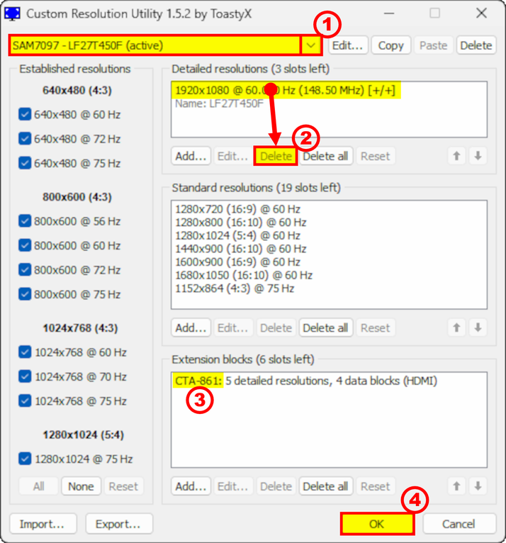

# Custom Resolution Utility (CRU)

[](https://GitHub.com/kreier/cru/releases/)

[](https://github.com/kreier/cru/actions/workflows/pages/pages-build-deployment)

This is just a fork of the work from [ToastyX](https://www.monitortests.com/forum/User-ToastyX). Since 2012 [his utility](https://www.monitortests.com/forum/Thread-Custom-Resolution-Utility-CRU) fixes several problems with graphic cards, monitors, drivers and their communication. Please download the latest version 1.5.3 from 2025-04-28 directly from [https://www.monitortests.com/forum/Thread-Custom-Resolution-Utility-CRU](https://www.monitortests.com/forum/Thread-Custom-Resolution-Utility-CRU) and consider supporting him [on Patreon](https://www.patreon.com/ToastyX).

Custom Resolution Utility (CRU) is an **EDID editor** that focuses on custom resolutions. CRU shows you how the monitor defines resolutions and other capabilities and gives you the power to change it. Add custom resolutions, remove unwanted resolutions, edit FreeSync ranges, and more. CRU creates software EDID overrides in the registry and does not modify the hardware.

[](https://www.patreon.com/ToastyX)

## Compatibility issues:

### NVIDIA and DSC - ToastyX Wrote:
```
NVIDIA's driver currently ignores EDID overrides if Display Stream Compression (DSC) is active and
the maximum resolution @ refresh rate combination exceeds the GPU's single-head pixel clock limit:

GTX 1600-series: 1330 MHz
RTX 2000-series: 1330 MHz
RTX 3000-series: 1335 MHz
RTX 4000-series: 1350 MHz
RTX 5000-series: 1620 MHz
```
Workarounds:

1. SRE can add custom GPU-scaled resolutions but not custom refresh rates: https://www.monitortests.com/forum/Threa...Editor-SRE
2. Use RegEdit to disable using multiple heads, but the pixel clock will be limited to the single-head limit:\
Key: HKEY_LOCAL_MACHINE\SYSTEM\CurrentControlSet\Control\Class\{4d36e968-e325-11ce-bfc1-08002be10318}\#### (usually 0000)\
Value: "EnableTiledDisplay"=dword:00000000

### NVIDIA and multiple displays - ToastyX Wrote:

NVIDIA's driver currently has a bug that can cause Windows to hang during boot when an EDID override is present with multiple displays connected. Workaround using scripts: [https://www.monitortests.com/forum/Threa...wn-scripts](https://www.monitortests.com/forum/Thread-Workarounds-for-Nvidia-issues-using-CRU-and-a-couple-of-startup-shutdown-scripts)

### Windows 11 with non-PnP displays - ToastyX Wrote:

Windows 11 ignores EDID overrides for displays that don't have a valid EDID. This can happen if the EDID is corrupted on the monitor. This will appear as "PNP09FF - Generic Non-PnP Monitor" in CRU with no resolutions or extension blocks listed.

Workarounds:
1. Try another port on the monitor. Usually each type of port has a separate EDID, so only one might be corrupted.
2. Use an EDID emulator such as this: [https://www.amazon.com/dp/B07YMS18T7/?tag=mtests-20#ad](https://www.amazon.com/dp/B07YMS18T7/?tag=mtests-20#ad)
3. Use Windows 10 with CRU to add the resolutions you need.
4. Advanced: try to fix the EDID on the monitor using EDWriter with an AMD GPU: [https://www.monitortests.com/forum/Threa...yID-Writer](https://www.monitortests.com/forum/Thread-EDID-DisplayID-Writer)


## Example

This is how this Windows program looks like:



### Requirements:

- Windows Vista or later (Windows XP does not support EDID overrides)
- AMD/ATI or NVIDIA GPU with appropriate driver installed (Microsoft Basic Display Adapter driver does not support EDID overrides)
- Intel GPUs and laptops with switchable graphics are supported with one of these drivers:
  - Newer Intel GPUs are supported with the latest drivers.
  - 6th generation (Skylake): [Intel Graphics Driver for Windows [15.45]](https://downloadcenter.intel.com/download/30195)
  - 4th/5th generation (Haswell/Broadwell): [Intel Graphics Driver for Windows [15.40]](https://downloadcenter.intel.com/download/30196)
  - 4th generation (Haswell) for Windows 7/8.1: [Intel Graphics Driver for Windows 7/8.1 [15.36]](https://downloadcenter.intel.com/download/29970)
  - Older Intel GPUs are supported for external displays only using the alternative method described below.

Before making any changes, familiarize yourself with booting Windows in safe mode using a recovery drive in case you can't see the screen. If you don't have a recovery drive, press and hold the power button to shut off the computer while Windows is booting. Doing this twice should give you recovery options that you can use to get into safe mode: Troubleshoot > Advanced options > Startup Settings > Restart

### Getting started:

1. Run CRU.exe. A UAC prompt may appear because it needs permission to access the registry.
2. Choose a display from the drop-down list.
    - "(active)" means the display is connected and recognized by the graphics driver.
    - "*" means changes were made and an override was saved in the registry.
3. Edit the configuration as desired. __Please read the sections below for more information.__
4. Repeat steps 2-3 for other displays if required.
    - The "Copy" and "Paste" buttons at the top can be used to copy all the resolutions, extension blocks, and range limits if included. It will not copy the name or serial number, but it will copy the inclusion of these items using the display's own information. Import follows the same logic unless "Import complete EDID" is selected.
5. Click "OK" to save the changes.
6. Run restart.exe to restart the graphics driver.
    - If the display does not return after 15 seconds, press F8 for recovery mode. This will temporarily unload all the EDID overrides without deleting them. Restart the driver again to reload any changes.
    - On some systems, the graphics driver might crash while restarting. If that happens, the driver might be disabled after rebooting. Simply run restart.exe again to enable the driver.
7. Set the resolution in the Windows display settings. To set the refresh rate:
    - Windows 10: right-click on the desktop > Display settings > Advanced display settings > Display adapter properties > Monitor tab
    - Windows Vista/7/8/8.1: right-click on the desktop > Screen resolution > Advanced settings > Monitor tab

To reset a display back to the default configuration, use the "Delete" button at the top to delete the override from the registry and reboot. To reset all displays, run reset-all.exe and reboot. This can be done in safe mode if necessary.

### Alternative method for Intel GPUs:

If you have an older Intel GPU, use the "Export..." button and choose "EXE file" for the file type to export a self-contained EDID override installer. Then run the .exe file and choose "Install EDID" to install the EDID override on all matching displays.

### Detailed resolutions:

* Detailed resolutions are the preferred way to add custom resolutions. More detailed resolutions can be added using extension blocks.
* The first detailed resolution is considered the preferred or native resolution. At least one detailed resolution should exist to define the native resolution. All other resolutions can be removed if they are not needed. The graphics driver will automatically add some common lower resolutions as scaled resolutions. To edit the list of scaled resolutions for AMD and NVIDIA GPUs, use [Scaled Resolution Editor](https://www.monitortests.com/forum/Thread-Scaled-Resolution-Editor-SRE).
* CRU adds monitor resolutions, not scaled resolutions. Lower resolutions can be scaled up to the native resolution by enabling GPU scaling in the graphics driver's control panel, but higher resolutions won't be scaled down by the GPU. Higher resolutions will only work if the monitor can handle them.
* Laptop displays usually don't have scalers and can't display non-native resolutions without GPU scaling. To add other refresh rates, add the refresh rate at the native resolution. The graphics driver will automatically add the refresh rate to lower scaled resolutions.
* Monitors with NVIDIA's G-SYNC processor only support a limited set of resolutions with display scaling. To add non-native resolutions, make sure GPU scaling is enabled in the NVIDIA control panel, or use [Scaled Resolution Editor](https://www.monitortests.com/forum/Thread-Scaled-Resolution-Editor-SRE).
* EDID detailed resolutions are limited to 4095x4095 and 655.35 MHz pixel clock. If a value turns <span style="color:red">**red**</span>, that means it's invalid or out of limits. Use a DisplayID extension block to add resolutions with higher limits.
* Use the timing options to help fill in the values:
    * Manual - Allows the timing parameters to be set manually. The dialog will always open in this mode. See also: [Timing parameters explained](https://www.monitortests.com/blog/timing-parameters-explained/)
    * Automatic PC - Uses standards common with PC monitors. Uses CTA-861 for 4:3/16:9 resolutions up to 1920x1080 @ 60 Hz, VESA DMT for 1360/1366x768 and 1600x900, CVT-RB otherwise.
    * Automatic HDTV - Uses standards common with HDTVs. Uses CTA-861 for all TV resolutions if possible, VESA DMT for 1360/1366x768 and 1600x900, CVT-RB otherwise.
    * Automatic CRT - Uses standards compatible with CRT monitors. Uses VESA DMT for 4:3/5:4 resolutions, CVT otherwise.
    * Native PC/HDTV - Uses the 60 Hz "Automatic" timing parameters for all refresh rates. This may help when trying other refresh rates.
    * Exact - Uses non-standard timing parameters to produce exact integer refresh rates.
    * Exact reduced - Adjusts the "Exact" timing parameters to reduce the pixel clock if possible. This may help when trying higher refresh rates.
    * Exact CRT - Uses timing parameters compatible with CRT monitors to produce exact integer refresh rates.
    * VESA standards:
        * CVT standard - Standard intended for CRT monitors.
        * CVT-RB standard - Standard intended for LCD monitors. Reduces the blanking compared with CVT.
        * CVT-RB2 standard - Newer standard intended for LCD monitors. Reduces the horizontal blanking compared with CVT-RB.
        * GTF standard - Old standard commonly used with CRT monitors.
    * Vertical total calculator - Calculates the vertical total required for the specified refresh rate and pixel clock. This can be used to implement [Quick Frame Transport (QFT)](https://forums.blurbusters.com/viewtopic.php?t=8946), which can help reduce crosstalk with backlight strobing at lower refresh rates.
* __Pay attention to pixel clock limits:__
    * Single-link DVI is limited to 165 MHz and dual-link DVI is limited to 330 MHz unless the graphics driver is patched:
        * [AMD/ATI Pixel Clock Patcher](https://www.monitortests.com/forum/Thread-AMD-ATI-Pixel-Clock-Patcher)
        * [NVIDIA Pixel Clock Patcher](https://www.monitortests.com/forum/Thread-NVIDIA-Pixel-Clock-Patcher)
    * HDMI is treated as single-link DVI unless an "HDMI support" data block is defined in a CTA-861 extension block.
    * HDMI 2.0 requires both an "HDMI support" data block and an "HDMI 2.0 support" data block.
    * HDMI limits depend on the GPU:
        * Newer GPUs with HDMI 2.0 support up to 600 MHz with HDMI 2.0 and up to 340 MHz with HDMI 1.x.
        * AMD HD 7000-series and newer GPUs without HDMI 2.0 support up to 297 MHz. Older GPUs are limited to 165 MHz unless the driver is patched.
        * Intel GPUs without HDMI 2.0 support up to 300.99 MHz.
        * AMD/ATI and Intel also listen to the maximum TMDS clock in the "HDMI support" data block. Make sure it's enabled and set to 340 MHz.
    * DisplayPort limits are listed here: [Common pixel clock limits](https://www.monitortests.com/blog/common-pixel-clock-limits/)
    * Passive DisplayPort to HDMI adapters are limited to 165 MHz unless the driver is patched.
    * These DisplayPort to HDMI 2.0 active adapters support up to 600 MHz pixel clock (Amazon affiliate links):
        * [Plugable DisplayPort 1.2 to HDMI 2.0 Active Adapter](https://www.amazon.com/dp/B00S0C7QO8/?tag=mtests-20#ad)
        * [Club 3D CAC-1080 DisplayPort 1.4 to HDMI 2.0b HDR Active Adapter](https://www.amazon.com/dp/B077JB28KM/?tag=mtests-20#ad)
        * [Club 3D CAC-1180 Mini DisplayPort 1.4 to HDMI 2.0b HDR Active Adapter](https://www.amazon.com/dp/B077J8655R/?tag=mtests-20#ad)

### Standard resolutions:

* Standard resolutions are mostly useful for CRT monitors and for adding lower resolutions with LCD monitors. Do not add the native resolution as a standard resolution.
* AMD/ATI only supports the resolutions in the drop-down list. Other resolutions will be ignored by the driver. These will be listed in gray.
* NVIDIA does not support more than 8 standard resolutions. Additional resolutions will use up detailed resolution slots.
* Standard resolutions are limited to certain aspect ratios: 4:3, 5:4, 16:9, 16:10. Use detailed resolutions for other aspect ratios.
* The horizontal resolution is limited to 256-2288 and must be a multiple of 8. Use detailed resolutions for other resolutions.
* The refresh rate is limited to 60-123 Hz. Use detailed resolutions for other refresh rates.

### Extension blocks:

* GPU-specific limtations:
    * CRU can read extension blocks from displays connected to AMD and NVIDIA GPUs.
    * CRU can't read extension blocks with Intel GPUs or switchable graphics.
    * Older drivers or GPUs may only support up to 3 extension blocks.
* Extension block types:
    * CTA-861 extension blocks can contain additional detailed resolutions and data blocks such as TV resolutions, audio formats, and HDMI support. Note: NVIDIA requires at least 2 bytes left for data blocks or the driver will ignore all changes.
    * Use VTB-EXT to add more standard resolutions. Note: AMD/ATI only supports one VTB-EXT block, and it must be the last block in the list.
    * Use DisplayID to add resolutions greater than 4095x4095 or 655.35 MHz pixel clock. DisplayID 2.0 supports pixel clocks with three decimal places, but the driver or hardware might not support such precision.
    * Default extension blocks are placeholders for the monitor's original extension blocks. Extension blocks that can't be read will appear as default extension blocks. Note: NVIDIA does not support default extension blocks and will ignore all changes if a default extension block exists.
* If you need to add an extension block manually, importing one of these files will provide a starting point:
    * [hdmi.dat](https://www.monitortests.com/download/dat/hdmi.dat) - HDMI support only
    * [hdmi-audio.dat](https://www.monitortests.com/download/dat/hdmi-audio.dat) - HDMI support with audio
    * [hdmi-bitstream.dat](https://www.monitortests.com/download/dat/hdmi-bitstream.dat) - HDMI support with bitstreaming audio formats
    * [hdmi2.dat](https://www.monitortests.com/download/dat/hdmi2.dat) - HDMI 2.0 support only
    * [hdmi2-audio.dat](https://www.monitortests.com/download/dat/hdmi2-audio.dat) - HDMI 2.0 support with audio
    * [hdmi2-bitstream.dat](https://www.monitortests.com/download/dat/hdmi2-bitstream.dat) - HDMI 2.0 support with bitstreaming audio formats
    * [displayport-audio.dat](https://www.monitortests.com/download/dat/displayport-audio.dat) - DisplayPort audio
 
### Editing FreeSync/VRR ranges:

* For DisplayPort, use the "Edit..." button at the top to edit the "V rate" under range limits, and make sure "Include if slot available" is enabled. Note: NVIDIA has ranges hard-coded for some monitors. To get around this, change the device ID at the top to anything else, such as ABC1234 (3 letters, 4 hex digits).
* For HDMI FreeSync, edit the "FreeSync range" data block in the CTA-861 extension block.
* For HDMI 2.1 VRR, edit the "HDMI 2.1 support" data block in the CTA-861 extension block.

### Export formats:

* .bin - Raw binary EDID compatible with most EDID tools
* .dat - Data file compatible with Phoenix EDID Designer and Advantiv EEditZ/EEditGold
* .inf - Unsigned monitor driver compatible with Windows Vista and later
* .txt - Text file containing whitespace-separated hexadecimal values (16 per line)
* .csv - Text file containing comma-separated hexadecimal values (one block per line)
* .exe - Self-contained EDID override installer (includes alternative method for Intel GPUs)

CRU can import all of the above formats and any reasonably formatted text file with hexadecimal values.

### Command-line options:

* Exported .exe files:
    * /i - Install EDID without prompting
    * /r - Reset EDID without prompting
* reset-all.exe:
    * /q - Reset without prompting
* restart.exe/restart64.exe:
    * /q - Restart without prompting (or rename the file to restart-only.exe)
    * /r - Activate recovery mode without prompting

### Memory clock issues:

* The GPU will not reduce the memory clock when idle if the vertical blanking is too low because there won't be enough time between refreshes to retrain the memory without screen corruption. Horizontal values can still be reduced if necessary.
    * Older AMD/ATI GPUs require the "Automatic PC/HDTV" or "CVT-RB standard" vertical blanking to reduce the memory clock when idle.
    * NVIDIA and newer AMD cards can handle some lower values depending on the resolution and refresh rate.
* Older AMD/ATI GPUs have a design limitation that causes video acceleration to scramble the screen if the vertical blanking is below standard with the GPU's memory overclocked or with multiple monitors connected. Skype is known to trigger this problem. Either don't overclock the GPU's memory, or use the "Automatic PC/HDTV" or "CVT-RB standard" vertical blanking.

## Changelog

### 2025-04-28 Changes in 1.5.3:

* Added support for extension override data blocks (HF-EEODB). All extension blocks should now be readable with AMD and NVIDIA GPUs.
* Added support for editing existing FreeSync version 3 data blocks with higher maximum range.
* EDID detailed resolutions: preserve borders if present.

### 2022-09-01 Changes in 1.5.2:

* Support up to 7 extension blocks
* NVIDIA can now read all extension blocks
* Detailed resolutions:
    * Added 480p/480i/525p/525i to "Automatic CRT"
    * Fixed "Exact" and "Exact reduced" for interlaced resolutions
    * Added "Exact CRT" timing option
    * Added "Vertical total calculator" timing option
* Audio formats: added "Auro-Cx" and "MPEG-D USAC" from CTA-861.6
* Colorimetry: added "sRGB" and "Default RGB" from [CTA-861.6](https://shop.cta.tech/products/cta-861-6)

### 2021-01-18 Changes in 1.5.1:

- Audio formats: added new formats from CTA-861-G/H
- Colorimetry: added ICtCp from CTA-861-H
- DisplayID 2.0 detailed resolutions: fix "Reset" button resetting to 6 Hz when adding a new resolution
- Tiled display topology: split vendor and product IDs to accommodate OUIs (2.0) and non-letter IDs (1.3)
- List boxes now retain scroll position after editing

### 2021-01-01 Changes in 1.5:
- Added DisplayPort YCbCr color formats and maximum color depth (use the "Edit..." button at the top)
- Added HDMI 2.1 features including maximum FRL rate, variable refresh rate, and display stream compression
- New and improved timing options for detailed resolutions:
    - "LCD standard" has been split into "Automatic (PC)" and "Automatic (HDTV)" to better accommodate different display standards.
    - The main difference is how they handle resolutions greater than 1920x1080 @ 60 Hz and 21:9 resolutions. "PC" favors CVT-RB, while "HDTV" favors CTA-861.
    - "LCD native" has been split into "Native (PC)" and "Native (HDTV)" for the same reason.
    - "LCD reduced" has been eliminated because it was too arbitrary and only worked for certain resolutions. Try "Exact reduced" for an alternative.
    - "CRT standard" is now "Automatic (CRT)" and includes 4:3/5:4 VESA DMT resolutions. Use "CVT standard" for the old behavior.
    - Added "Exact" and "Exact reduced" to calculate exact integer refresh rates.
    - Added common display standards: CVT, CVT-RB, CVT-RB2, and GTF (previously "Old standard")
- Detailed resolutions can now calculate frequencies for all possible pixel clocks (up to 167772.16 MHz for DisplayID 1.3)
- CEA-861 extension blocks are now called CTA-861 to reflect the standard's new name
- Added support for DisplayID 2.0 extension blocks
- Export now saves the original unmodified EDID if no changes were made

### 2019-10-30 Changes in 1.4.2:

- List inactive displays with overrides installed
- Display properties: interpret "0" ID serial number as blank
- Detailed resolutions: "LCD reduced" will no longer go below 56 horizontal blanking
- DisplayID detailed resolutions: fixed interlaced calculations to match DisplayID standard
- HDMI 2.0 support: enable "SCDC present" by default when adding new data blocks
- Added `.csv` file export: outputs comma-separated hexadecimal values (one block per line)
- Added `.exe` file export: outputs self-contained EDID override installers (includes alternative method for Intel GPUs)
- `reset-all.exe`: Reset alternative method for Intel GPUs, added /q option
- `restart.exe`/`restart64.exe`: Faster restarts, recovery mode includes alternative method for Intel GPUs, added /r option

### 2018-09-17 Changes in 1.4.1:

- Speaker setup: added new speakers from CTA-861-G
- HDMI support: fixed undefined latency data saving as 2 ms (since 1.3.99-p1)
- HDMI 2.0 support: preserve additional fields for HDMI 2.1
- FreeSync range: added support for editing FreeSync 2 ranges
- Added support for HDR static metadata blocks

### 2018-07-14 Changes in 1.4:

- Added support for DisplayID extension blocks:
    - Added support for "Type I" detailed resolutions.
    - Added support for tiled display topology data blocks.
- Display properties: added support for ID serial number in EDID header
- Detailed resolutions: added "Automatic - Old standard" timing option for GTF
- TV resolutions: added new resolutions from [CTA-861-G](https://web.archive.org/web/20171201033424/https://standards.cta.tech/kwspub/published_docs/CTA-861-G_FINAL_revised_2017.pdf) (requires driver support)
- Colorimetry: added DCI-P3 standard from [CTA-861-G](https://archive.org/details/CTA-861-G/mode/2up)

More about Display Technology Information at [https://glenwing.github.io/](https://glenwing.github.io/) with [Display Industry Standards](https://glenwing.github.io/docs/) like DP, HDMI, DVI, CTA-861, DCI and VESA

### 2018-01-24 Patch 1 v1.3.99-p1

Version v1.4 will be released later the year. Release notes for this patch version are later mostly transferred to v1.4. The source code for this version code is published. It can be found at https://github.com/radamar/Custom-Resolution-Utility-ToastyX where it was uploaded 2018-04-11.

### 2017-08-24 Changes in 1.3.1:

- Fixed .inf export for Windows 10 Creators Update
- Detailed resolutions: use CEA-861 timing parameters for `3840x2160 @ 60 Hz` with "LCD standard" (use "LCD reduced" for old values)
- Detailed resolutions: allow 0 back porch
- TV resolutions: disable "Native format" for resolutions that don't support this option
- Do not add blank extension block if no extension blocks exist by default
- Allow invalid but possible product IDs when editing display properties
- Fixed '`&`' character in monitor name and serial number not displaying correctly in detailed resolutions list box
- Improved row spacing between UI elements with higher DPI settings

### 2016-10-30 Changes in 1.3:

* Added support for reading extension blocks from connected monitors with AMD/ATI and NVIDIA
* Automatically add blank extension block in registry and exported .inf files to work around NVIDIA driver issues
* Added support for multiple extension blocks
* Added support for importing other types of extension blocks
* Added support for VTB-EXT extension blocks (detailed/standard resolutions only)
* Changed default TMDS clock to 340 MHz for new HDMI data blocks
* Added support for HDMI 2.0 data blocks
* Added support for HDMI FreeSync data blocks
* Added BT.2020 formats in colorimetry data blocks
* Added text file export (outputs hex values)
* Improved UI scaling with higher DPI settings
* `restart.exe`/`restart64.exe`: fix Start menu, search box, and Radeon Settings not responding after restarting

### 2016-09-28 Patch 2 for v1.2 in v1.2.99-p2

* Final patch for the old v1.2 a month before the new v1.3 is ready for release with many more features and extended support

### 2016-04-23 Patch 1 for v1.2 in v1.2.99-p1

* No major update yet, small patches for the 2015 version of `cru` until the release of v1.3 later the year

### 2015-12-22 Changes in 1.2.6:

* Fixed a bug affecting non-PnP monitors since 1.2.3 (invalid EDID version with new overrides)

### 2015-12-04 Changes in 1.2.5:

* Include range limits by default if min/max horizontal values match and certain conditions are met (for * * * FreeSync monitors)
* `restart.exe`/`restart64.exe`: restart Radeon Settings (`cnext.exe`)

### 2015-11-20 Changes in 1.2.4:

* Made range limits compatible with FreeSync monitors

### 2015-11-17 Changes in 1.2.3:

* Added basic support for range limits and serial number descriptors (use the "Edit..." button at the top)
* Show included descriptors in the detailed resolution list
* Added "Import complete EDID" option

### 2015-09-05 Changes in 1.2.2:

* Detailed resolutions: added "LCD reduced" timing parameters for 2560x1440 @ 144 Hz and higher resolutions
* Extension block: added support for colorimetry and video capability data blocks
* Redesigned icon to scale better with Windows 10's broken taskbar scaling
* Fixed how disabled buttons appear with Windows 10

### 2015-07-28 Changes in 1.2.1:

* Detailed resolutions: added "LCD native" option
* TV resolutions: added support for 4:2:0 resolutions
* HDMI support: added support for HDMI resolutions, latency information, and supported content types
* Fixed access violation in `comctl32.dll` message with higher DPI settings
* Fixed layout issues with higher DPI settings and enabled DPI awareness
* `restart.exe`/`restart64.exe`: implemented a better recovery mode

### 2015-02-14 Changes in 1.2:

* Added custom extension block editing
* Added support for more than 8 standard resolutions (AMD/ATI only)
* Added support for other standard resolutions (NVIDIA only)
* Updated `reset-all.exe` to reset Windows resolution settings
* Include new version of `restart.exe`/`restart64.exe`

### 2014-04-05 Changes in 1.1.2:

* Fixed HDMI audio not working with older ATI GPUs

### 2014-02-14 Changes in 1.1.1:

* Fixed monitors with invalid signal type information not working with AMD/ATI GPUs
* Added "LCD standard" timing parameters for 3840x2160 @ 30 Hz and 1366x768 @ 60 Hz (use "LCD reduced" for old values)
* Automatically enable extension block when importing extension block files
* Show number of slots left

### 2013-10-01 Changes in 1.1:

* Import extension block from files (editing coming later)
* Automatically fill in likely native resolution when adding a detailed resolution
* Disable controls when deleting a monitor

### 2013-08-24 Changes in 1.0.1:

* Fixed `.inf` export
* Added support for non-PnP monitors
* Changed monitor list sorting

## Software environment for this C++ project

As posted 2020-12-20 in this forum https://www.monitortests.com/forum/Thread-What-is-the-development-enviroment-of-open-source-software-CRU this software is written with Borland Turbo C++ Builder 2006.
